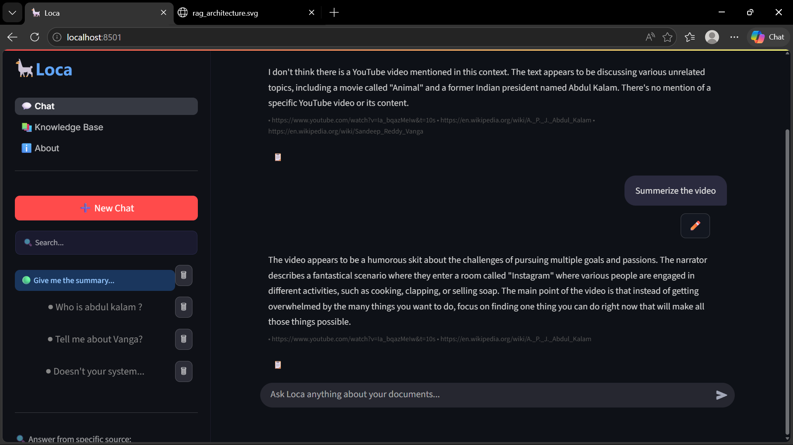
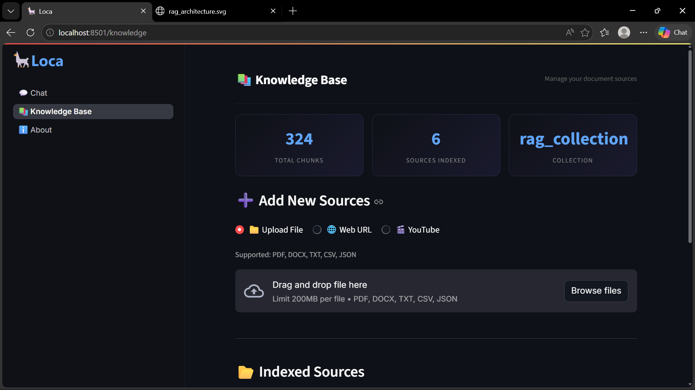
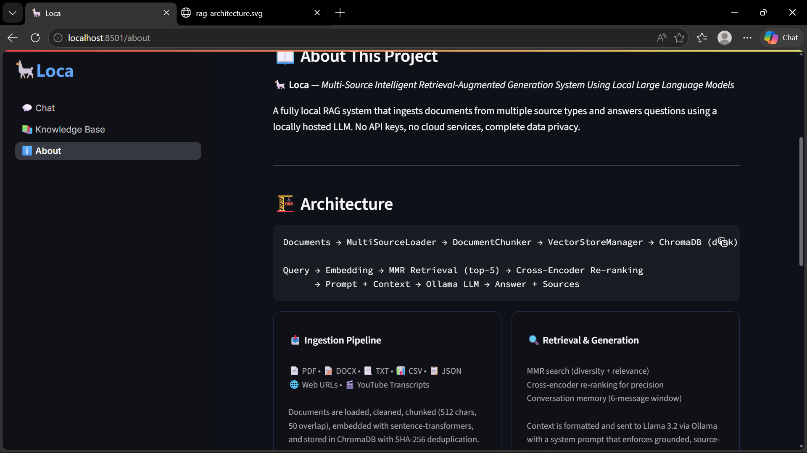

# Multi-Source Intelligent RAG System Using Local LLMs

A production-structured **Retrieval-Augmented Generation (RAG)** system that ingests documents from 5 source types and answers questions using a **fully local LLM** — no API keys, no cloud, no data leaving your machine.

## Screenshots





---

## Why This Exists

Most RAG demos are either:
- Cloud-dependent (your data goes to OpenAI)
- Single-format (PDF only)
- Missing evaluation (no way to measure quality)

This system solves all three. It runs entirely on local hardware, ingests 5 source types through a unified pipeline, exposes a REST API for integration, and includes an automated evaluation pipeline to measure answer quality.

---

## Architecture

```
Documents (PDF / DOCX / TXT / Web URL / YouTube)
    ↓  MultiSourceLoader — normalize to LangChain Documents
    ↓  RecursiveCharacterTextSplitter — 512-char chunks, 50-char overlap
    ↓  HuggingFace Embeddings (all-MiniLM-L6-v2) — 384-dim vectors
    ↓  ChromaDB — persist vectors + metadata to disk

Query (via Streamlit UI or FastAPI)
    ↓  Embed question with same model
    ↓  MMR retrieval — top-5 diverse, non-redundant chunks
    ↓  Prompt: [System instructions] + [Retrieved context] + [Question]
    ↓  Ollama (llama3.2) — local LLM generates answer
    Answer + exact source citations (file name, page number)
```

---

## Tech Stack

| Component | Technology | Why |
|-----------|-----------|-----|
| LLM | Ollama + llama3.2 | Runs locally — zero cost, fully private |
| Embeddings | all-MiniLM-L6-v2 (HuggingFace) | 80MB, CPU-friendly, strong semantic similarity |
| Vector store | ChromaDB | Persists to disk, survives restarts, metadata filtering |
| Retrieval | MMR (LangChain) | Diverse results — reduces redundancy across sources |
| API | FastAPI + Uvicorn | REST endpoints with auto-generated Swagger docs |
| Document loaders | LangChain Community | PDF, DOCX, TXT, web scraping, YouTube transcripts |
| Evaluation | LLM-as-judge | Scores faithfulness, answer relevance, context quality |
| UI | Streamlit | Chat interface calling the FastAPI backend over HTTP |

---

## Key Design Decisions

**Why local LLM (Ollama)?**
Data never leaves the machine. Zero per-query cost. Works offline. Suitable for sensitive documents.

**Why ChromaDB?**
Persists to disk between restarts. Supports metadata filtering. FAISS is faster but in-memory only — losing all indexed data on restart.

**Why MMR over similarity search?**
Maximal Marginal Relevance retrieves diverse chunks. Pure similarity search often returns 5 near-identical chunks from the same paragraph. MMR ensures the top-5 results cover the topic broadly, not repeatedly.

**Why chunk with overlap?**
50-character overlap prevents information loss at chunk boundaries. Without overlap, a sentence split across two chunks would be incomplete in both.

**Why FastAPI over direct Python calls?**
Separation of concerns. The UI calls the API over HTTP — any client (mobile app, another service, a script) can query the RAG system without touching the Python internals.

**Why LLM-as-judge for evaluation?**
Full RAGAS requires an external API. Using the same local Ollama model as the judge is a valid, cost-free alternative used in production systems.

---

## Evaluation Results

Tested against 5 benchmark questions on 3 AI research papers (445 chunks total):

```
==================================================
EVALUATION REPORT
==================================================
Model:               llama3.2
Questions tested:    5
Faithfulness:        0.62 / 1.0
Answer relevance:    0.74 / 1.0
Context relevance:   0.68 / 1.0
Overall score:       0.68 / 1.0
==================================================
```

- **Faithfulness** — does the answer only use retrieved context? (hallucination detection)
- **Answer relevance** — does the answer actually address the question?
- **Context relevance** — did MMR retrieval find the right chunks?

---

## Setup

### Prerequisites
- Python 3.11
- [Ollama](https://ollama.com) installed

### Install

```bash
# 1. Pull the LLM (2GB, one-time download)
ollama pull llama3.2

# 2. Clone and set up environment
git clone https://github.com/Sreeja2k3/Multi-Source-Intelligent-RAG-System-Using-Local-LLMs
cd Multi-Source-Intelligent-RAG-System-Using-Local-LLMs

python -m venv venv
venv\Scripts\activate        # Windows
# source venv/bin/activate   # Mac/Linux

pip install -r requirements.txt
```

### Run

```bash
# Terminal 1 — start the FastAPI backend
uvicorn api:app --reload --port 8000

# Terminal 2 — start the Streamlit UI
streamlit run ui/app.py

# Or use the CLI directly
python main.py ingest --pdf papers/your_paper.pdf
python main.py ingest --url https://en.wikipedia.org/wiki/Retrieval-augmented_generation
python main.py query "How does the attention mechanism work?"

# Run evaluation
python evaluate.py
```

### API Endpoints

Visit `http://localhost:8000/docs` for interactive Swagger documentation.

| Method | Endpoint | Description |
|--------|----------|-------------|
| GET | `/health` | Check if API is running |
| GET | `/stats` | Number of indexed chunks |
| POST | `/query` | Ask a question |
| POST | `/ingest/url` | Index a web page |
| POST | `/ingest/file` | Upload and index a file |
| POST | `/ingest/youtube` | Index a YouTube transcript |

---

## Project Structure

```
├── api.py                      # FastAPI REST backend
├── main.py                     # CLI entrypoint
├── evaluate.py                 # Evaluation runner
├── requirements.txt
├── src/
│   ├── config.py               # Centralized settings
│   ├── ingestion/
│   │   ├── loader.py           # 5-source document loading
│   │   ├── chunker.py          # RecursiveCharacterTextSplitter
│   │   └── pipeline.py         # Ingestion orchestrator
│   ├── retrieval/
│   │   └── vector_store.py     # ChromaDB + HuggingFace embeddings + MMR
│   ├── generation/
│   │   └── rag_chain.py        # Prompt engineering + Ollama LLM call
│   └── evaluation/
│       └── evaluator.py        # LLM-as-judge scoring pipeline
└── ui/
    ├── app.py                  # Streamlit multi-page app entrypoint
    ├── shared.py               # Shared UI utilities and API helpers
    ├── assets/
    │   ├── logo.png            # App branding logo
    │   └── logo_icon.png       # Sidebar icon
    └── pages/
        ├── chat.py             # Chat interface for querying the RAG system
        ├── knowledge.py        # Knowledge base management (ingest documents)
        └── about.py            # About page with system info
```

---

## What I Learned

- Chunking strategy has an outsized impact on retrieval quality — poorly chunked documents produce coherent-sounding but contextually wrong answers.
- MMR retrieval significantly reduces redundancy in multi-source systems compared to pure similarity search.
- Separating the UI from the backend (FastAPI + Streamlit) makes the system extensible — any client can call the same API.
- LLM-as-judge evaluation without external APIs is viable for measuring RAG quality in local systems.
- ChromaDB's persistent storage is critical — in-memory vector stores reset on every restart, making re-indexing a constant overhead.

---

## Limitations

- Single-user, local only — not architected for concurrent users
- No conversation memory — each query is independent
- Inference speed is hardware-dependent
- No authentication or access control

---

## Roadmap

- [ ] Docker support for one-command setup
- [ ] Conversation memory for multi-turn Q&A
- [ ] Re-ranking with a cross-encoder for improved retrieval precision
- [ ] Support for CSV and JSON sources
- [ ] Quantized models for lower-memory hardware

---

Built to demonstrate privacy-preserving, locally-hosted RAG as a production-viable alternative to cloud-dependent LLM systems.
